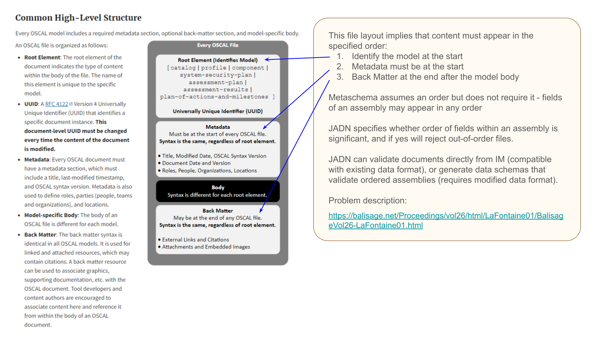

# Modeling OSCAL in JADN

When beginning the OSCAL project, a conceptual IM could be defined based on the OSCAL top-level description:

This conceptual [information model](Generated/oscal-concept.jidl) based on the Common High-Level Structure
minimizes duplication - the overall model structure is defined once as opposed to the actual approach of
repeating the same Metaschema structure in each of the models.
A goal of any information modeling language is not to impose a design philosophy but to provide the
expressive power to allow model designers to communicate their intent unambiguously, clearly and succinctly.

The actual JADN information model for OSCAL uses a different pattern that matches the published OSCAL
specification, which does not require content to appear in any particular order. Back-matter could appear
at the front of an OSCAL document, or Metadata after the Body, because the current Metaschema does not
impose a serialization order. A JADN IM can define field ordering if that is the designer's intent,
but implementing it in JSON Schema would require a change to the serialization format.

[Element Order is Always Important, Except When It Isn't](https://balisage.net/Proceedings/vol26/html/LaFontaine01/BalisageVol26-LaFontaine01.html):
Information Models can help.